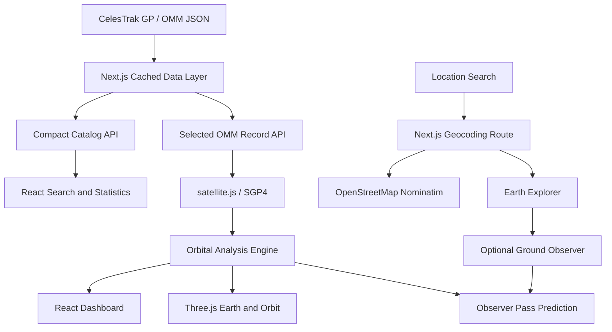

# YTS Orbital

**Satellite Operations & Orbital Intelligence**

YTS Orbital is a browser-based orbital visualization and analysis platform from York Tech Services R&D. It loads current public CelesTrak General Perturbations data, propagates spacecraft states with SGP4, and presents the result through an interactive mission-control dashboard.

## Overview

Search the current active-object catalog, select a spacecraft, inspect its propagated state and orbit geometry, move simulation time across a 12-hour window, and predict upcoming geometric passes for a configurable ground observer. The initial selection is the International Space Station when it is present in the active catalog.

All displayed positions and trajectories are calculated from public orbital elements. YTS Orbital does not fabricate coordinates and does not receive spacecraft telemetry.

## Features

- Current CelesTrak GP orbital data in OMM JSON format
- SGP4 propagation through `satellite.js`
- Real-time latitude, longitude, altitude, and velocity
- Interactive procedural 3D Earth with an Earth-fixed spacecraft marker
- Earth Explorer globe selection, coordinate extraction, and smooth camera focus
- Server-side geographic search with OpenStreetMap Nominatim
- Earth, Location, and Satellite camera modes
- Actual sampled orbital trajectory visualization
- Time Machine simulation from -6 to +6 hours with playback controls
- Derived period, semi-major axis, perigee, apogee, and orbit classification
- Search by object name, NORAD catalog ID, or international designator
- Observer configuration persisted locally in the browser
- 24-hour geometric pass prediction above a 10-degree elevation mask
- Element-age and factual orbital data-quality observations
- Intentional loading, upstream error, and propagation-error states

## Architecture



The browser never downloads directly from CelesTrak. The fixed server-side endpoint is cached by Next.js with a minimum revalidation period of 7,200 seconds. Search uses the compact catalog already loaded in the browser; selecting an object requests its full OMM record from the same cached server data layer.

## Orbital Pipeline

```text
OMM -> SatRec -> SGP4 -> TEME/ECI position and velocity
    -> ECF and geodetic coordinates -> visualization and observer geometry
```

`satellite.js` converts the selected OMM object into an SGP4 satellite record and propagates it at the requested simulation timestamp. The analysis layer transforms the resulting inertial position into Earth-fixed coordinates for the globe, and into geodetic latitude, longitude, and altitude for instrumentation.

The orbit line is not a generic circle. It is generated by propagating the selected record across approximately one orbital period and sampling the resulting Earth-fixed positions.

## Earth Explorer

Earth Explorer turns the holographic globe into an interactive geospatial surface without changing its orbital-operations focus. A click or intentional tap on Earth is raycast against the globe, converted into signed latitude and longitude, and displayed with a temporary target marker. Drag gestures remain reserved for globe rotation.

The view control provides three camera modes:

- **Earth:** a full-globe overview for geographic exploration
- **Location:** a smooth regional focus on the selected coordinate
- **Satellite:** a locked, continuous Earth-fixed camera follow that tracks the selected spacecraft direction and reveals Earth moving beneath its orbit; choose Earth or Location mode to resume manual rotation and zoom

The globe includes a curated set of clickable major-city reference pins distributed across inhabited regions. Priority labels remain visible at global scale, while additional labels appear at local scale. Location focus now moves to a closer city-scale view, and manual zoom can approach the surface further for more precise coordinate selection.

City labels use horizon hysteresis instead of raycast occlusion so they remain stable while the globe or satellite-follow camera moves. The primary directional light follows the approximate subsolar point at simulation time. A separate low-intensity urban light layer places softly additive clusters over major population corridors, fades them through the terminator, and gives each point a slow independent glisten only on the night hemisphere. Selecting a target uses a readable local-scale focus; the persistent Return control clears the target and restores the camera mode that was active before selection.

Geographic search runs only after an explicit form submission. The browser calls the constrained Next.js `/api/geocode` route, which validates the query and requests up to five normalized results from OpenStreetMap Nominatim. Selecting a result focuses the globe and displays its coordinates. A selected location can replace the persisted ground observer, immediately reusing the existing geometric pass-prediction pipeline.

Globe clicks and search selections also call the server-side `/api/reverse-geocode` route. It combines OpenStreetMap's named feature, administrative hierarchy, and optional population tags with BigDataCloud's broad geographic context and ocean naming. The Earth Explorer readout distinguishes populated, remote, and open-water areas and reports only source-provided population values; it explicitly marks population as unavailable when no defensible estimate exists.

Earth Explorer remains operational when the CelesTrak catalog is unavailable. In this degraded mode, the application clearly marks satellite data as offline, disables satellite camera mode, and retains globe interaction, place search, reverse geographic context, coordinate selection, and observer placement. The client refreshes both the catalog and selected orbital record every five minutes during normal operation and retries every minute during an outage. It also retries immediately when the browser reconnects or a degraded tab becomes visible. The outage notice can be acknowledged without stopping retries; recovery restores the full dashboard and raises a separate green confirmation notice.

The forward and inverse transforms share one Earth-fixed convention: ECEF `+X` is 0° longitude, ECEF `+Y` is 90° east, and ECEF `+Z` is north; Three.js scene axes use `[ECEF x, ECEF z, -ECEF y]`. Continents, observer, selected location, sub-satellite point, and spacecraft position therefore remain aligned while Time Machine changes the propagated satellite state.

Earth Explorer is intentionally limited to global, regional, and orbital-scale exploration. It is not a terrestrial GIS, navigation tool, or street-mapping platform.

## Running Locally

Requirements: Node.js 20.9 or newer and npm.

```bash
npm install
npm run dev
```

Open [http://localhost:3000](http://localhost:3000).

Production validation:

```bash
npm run lint
npm test
npm run build
npm start
```

## Data Source

Orbital elements come from the [CelesTrak Active Satellites GP catalog](https://celestrak.org/NORAD/elements/gp.php?GROUP=ACTIVE&FORMAT=JSON), explicitly requested as OMM JSON.

CelesTrak data is fetched only by the Next.js server layer. Framework fetch caching uses a 7,200-second revalidation interval to avoid repeatedly downloading an unchanged catalog. Local SGP4 propagation updates the spacecraft state; the application does not re-download elements on each tick.

The local holographic coastline layer uses the 1:110m land topology from [`world-atlas`](https://github.com/topojson/world-atlas), derived from public-domain [Natural Earth](https://www.naturalearthdata.com/) data. No geographic asset is fetched at runtime.

Location search is provided by [OpenStreetMap Nominatim](https://nominatim.org/). Requests are made server-side, only after explicit searches, and successful responses are cached for 24 hours. Search data is © OpenStreetMap contributors.

## Methodology

YTS Orbital uses the standard SGP4 model implemented by `satellite.js`. Derived two-body characteristics use an Earth equatorial radius of 6,378.137 km and gravitational parameter of 398,600.4418 km³/s². Orbit regime labels are intentionally simple:

- **LEO:** apogee at or below 2,000 km
- **GEO:** period from 1,380 to 1,500 minutes with eccentricity at or below 0.08
- **HEO:** eccentricity at or above 0.25 and apogee above 2,000 km
- **MEO:** non-LEO orbit with perigee below geosynchronous altitude
- **Other:** remaining orbital geometries

These labels describe calculated orbit geometry. They do not imply operational status.

## Pass Prediction

Passes are calculated geometrically for the observer location. The engine propagates the selected spacecraft in 30-second steps across the next 24 hours, transforms positions into Earth-fixed coordinates, calculates observer look angles, and detects crossings of a configurable 10-degree minimum elevation.

AOS, maximum sampled elevation, LOS, duration, and AOS azimuth are derived from those samples. Weather, sunlight, spacecraft brightness, local terrain, obstructions, and optical visibility are not considered.

## Limitations

- This application does not receive spacecraft telemetry.
- It does not report battery, communications, payload, propulsion, or hardware health.
- It is not a collision-avoidance or conjunction-assessment system.
- It is not intended for navigation, launch operations, flight safety, or safety-critical use.
- GP accuracy depends on source data, element age, orbit regime, and propagation interval.
- Predicted optical visibility is not provided.
- Pass transition times are sampled to approximately 30-second resolution in v0.1.

## Roadmap

### v0.1
Orbital visualization and propagation

### v0.2
Enhanced ground station and pass analysis

### v0.3
Constellation visualization and analysis

### v0.4
Historical orbital-state comparison and anomaly research

### v0.5
Simulated spacecraft telemetry ingestion

### v0.6
Telemetry anomaly-detection research

### Future
Satellite Operations Platform research

## Technology

- Next.js App Router
- TypeScript and React
- React Three Fiber and Three.js
- `satellite.js`
- Natural Earth geography via `world-atlas` and `topojson-client`
- Tailwind CSS
- CelesTrak GP data

## License

Licensed under the [MIT License](LICENSE).