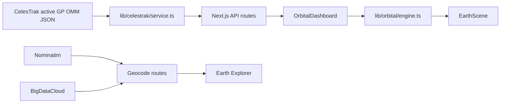

# 01 — Project Overview

> **PRIVATE DEVELOPER REFERENCE — NOT PUBLIC-FACING**

## Plain-language picture

YTS Orbital is an educational satellite dashboard. It downloads current public orbital elements, lets a learner choose an active satellite, and estimates where that satellite is at a chosen time. The center globe makes the estimate visible; the side panels explain the selected object, its orbit, and passes over an observer.

The key word is **estimates**. The app does not talk to spacecraft. It uses a standard mathematical model, SGP4, with public CelesTrak data.

## What a user can do

- Search the active-object catalog by name, international designator, or NORAD catalog ID.
- Choose a featured satellite.
- View estimated latitude, longitude, altitude, and speed.
- Move simulation time backward or forward and play it at `1x`, `60x`, or `300x`.
- See a sampled orbit path around the selected simulation time.
- Estimate geometric passes above an observer.
- Explore Earth by clicking the globe, selecting one of 24 city pins, or searching for a place.
- Continue using Earth Explorer if the satellite feed is unavailable.

## Main technologies

| Technology | Why it is here |
|---|---|
| Next.js | Supplies the page, server route handlers, dynamic loading, and server caching. |
| React | Manages interactive dashboard state and renders the interface. |
| TypeScript | Defines the shapes shared by routes, calculations, and components. |
| `satellite.js` | Converts OMM JSON to a `SatRec` and runs SGP4 propagation and frame conversions. |
| Three.js | Supplies vectors, geometry, materials, lighting, and camera math. |
| React Three Fiber | Lets the globe scene be described as React components. |
| `@react-three/drei` | Provides helpers including `Line`, `OrbitControls`, `Stars`, and `Html`. |
| `topojson-client` and `world-atlas` | Turn `data/land-110m.json` into coastline lines. |
| Vitest | Tests orbital calculations and geographic/scene coordinate conversion. |

The exact dependency versions are in `package.json`.

## The application in one diagram

## Important source boundaries

`app/page.tsx` is intentionally small: `Home` returns `OrbitalDashboard`.

`components/dashboard/orbital-dashboard.tsx` is the main client controller. `OrbitalDashboard` owns the selected satellite, simulation clock, observer, feed status, and selected Earth location.

`lib/celestrak/service.ts` is server-only. It owns the external CelesTrak request and catalog normalization.

`lib/orbital/engine.ts` is the calculation layer. It contains conversions, derived orbit values, SGP4 propagation, orbit-path sampling, and pass prediction.

`components/globe/earth-scene.tsx` is the 3D presentation layer. It receives already-computed `PropagatedState` and path points rather than fetching satellite data itself.

`types/orbital.ts` is the shared vocabulary. Its interfaces make route responses and component props explicit.

## Two clocks, not one

The dashboard keeps both `clock` and `simulationTime`.

- `clock` follows the real current time and drives the UTC header and element-age display.
- `simulationTime` can be live, paused, shifted, or accelerated and drives satellite propagation.

This separation is why a learner can inspect a future orbit position while still seeing the actual current UTC time.

## Accuracy and scope

The result depends on the age and quality of the OMM elements and on SGP4’s intended modeling range. The orbit path is sampled for display; it is not an independent source of truth. Passes are geometric and do not account for weather, lighting, terrain, brightness, or optical visibility.

Do not describe YTS Orbital as live telemetry. It is an educational and research dashboard based on public orbital elements, not a safety-critical operations system.

## Where to continue

Read [02 — Architecture and Data Flow](02-architecture-and-data-flow.md) for the request lifecycle, then [03 — CelesTrak Catalog Pipeline](03-celestrak-catalog-pipeline.md) for the source-data path.
