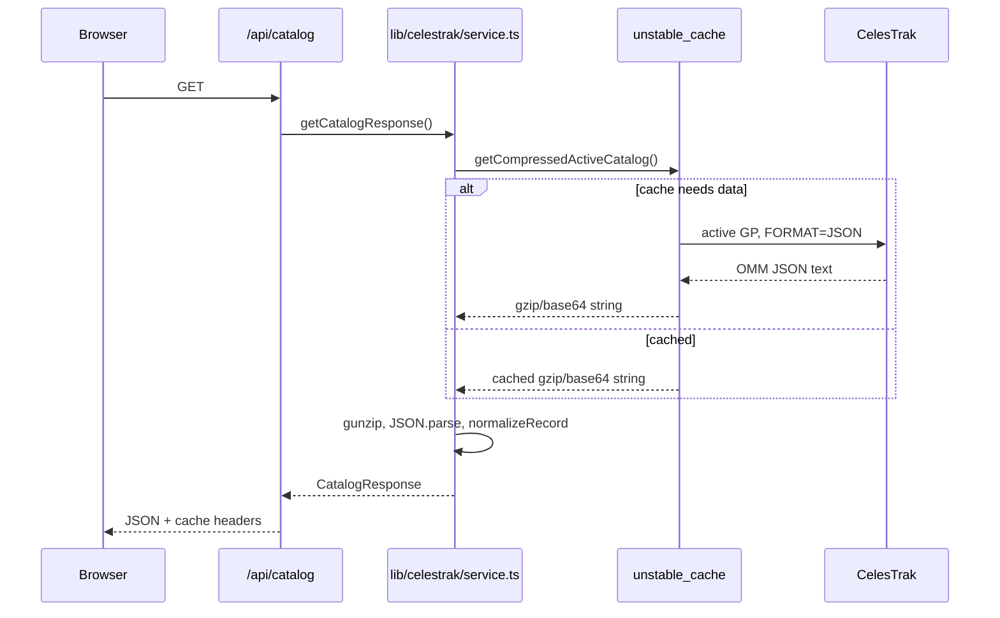

# 03 — CelesTrak Catalog Pipeline

> **PRIVATE DEVELOPER REFERENCE — NOT PUBLIC-FACING**

## Plain-language picture

CelesTrak publishes orbital elements for active objects. YTS Orbital asks for that active catalog in OMM JSON form, checks that essential values are usable numbers, caches the result, and exposes smaller local API responses to the browser.

The source URL is the `ACTIVE_GP_URL` constant in `lib/celestrak/service.ts`:

```text
https://celestrak.org/NORAD/elements/gp.php?GROUP=ACTIVE&FORMAT=JSON
```

This is CelesTrak’s active GP endpoint with `FORMAT=JSON`. The records follow the OMM field model used by `OmmRecord`.

## End-to-end path



## Why there are two server cache layers

`getCompressedActiveCatalog` is wrapped in `unstable_cache` with `revalidate: 7200`. Two hours is also expressed as `REVALIDATE_SECONDS = 7200`.

The cached value is a gzip-compressed, base64-encoded string. Compression reduces the storage size of the large JSON catalog. Base64 makes the compressed bytes safe to store as a string.

`memoryCatalog` is a module-level `Promise<OmmRecord[]> | null`. It deduplicates concurrent work in the current server process. If several requests arrive before parsing finishes, they can await the same promise.

If loading fails, the catch handler resets `memoryCatalog` to `null`. That reset matters: a rejected promise must not permanently poison the in-process cache.

## Fetch and normalization

The remote fetch uses `cache: "no-store"` because `unstable_cache` is the intentional cache owner. After decompression and `JSON.parse`, `getActiveSatelliteData()` requires a non-empty array and maps every item through `normalizeRecord()`.

`finiteNumber()` accepts an existing number or converts a numeric string with `Number`. It rejects `NaN`, infinities, and missing required numeric values.

`normalizeRecord()` requires these identity strings:

- `OBJECT_NAME`
- `OBJECT_ID`
- `EPOCH`

It also normalizes required orbital fields such as `NORAD_CAT_ID`, `MEAN_MOTION`, `ECCENTRICITY`, and `INCLINATION`. Optional descriptive fields remain optional.

Why normalize at the boundary? Downstream calculations can work with a trusted `OmmRecord` instead of repeatedly checking unknown remote JSON.

## Catalog shaping

`toCatalogEntry(record)` creates the smaller search representation. `getSatelliteCatalog()` maps all records to that shape, while `getSatelliteByNoradId(noradId)` returns one full `OmmRecord` or `null`.

`getCatalogStatistics(records)` calls `getOrbitalCharacteristics(record)` and counts `LEO`, `MEO`, `GEO`, and `HEO`. `OTHER` contributes to `total` but has no dedicated statistic field.

`getFeatured(records)` tries these candidates in order:

1. NORAD `25544`
2. NORAD `20580`
3. NORAD `43013`
4. The first name beginning with `GPS` or `NAVSTAR`
5. The first name beginning with `STARLINK-`

It removes missing and duplicate records before converting them to `SatelliteCatalogEntry` values.

## Local API routes

`GET` in `app/api/catalog/route.ts` returns `getCatalogResponse()`. Both catalog routes specify `runtime = "nodejs"`, which is required by the Node `zlib` use in the service.

`GET` in `app/api/satellites/[noradId]/route.ts` accepts only one to seven decimal digits. It returns:

- `400` for an invalid ID format.
- `404` when the ID is absent from the active catalog.
- `503` when orbital elements cannot be retrieved.

Successful catalog and satellite responses use:

```text
Cache-Control: public, s-maxage=7200, stale-while-revalidate=300
```

That header permits shared response caching for two hours and a five-minute stale response window during revalidation.

## What happens in the browser

The browser receives OMM data but does not fetch CelesTrak itself. For the selected object, `OrbitalDashboard` calls `createSatRecFromOmm`, which delegates to `satellite.js` `json2satrec`. Propagation then runs locally for each new `simulationTime`.

This server-fetch/client-propagate design keeps provider access and normalization centralized while making time controls responsive.
