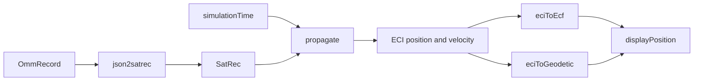

# 05 — Propagation and Coordinate Frames

> **PRIVATE DEVELOPER REFERENCE — NOT PUBLIC-FACING**

## Plain-language picture

Orbital elements describe an orbit, not a ready-to-draw dot. To place the satellite on the globe, YTS Orbital asks SGP4 for a position at `simulationTime`, rotates that position into an Earth-fixed frame, converts it to latitude/longitude/altitude, and finally maps it into the Three.js coordinate convention used by the scene.

## OMM to `SatRec`

`createSatRecFromOmm(omm)` calls `satellite.js` `json2satrec`:

```ts
export function createSatRecFromOmm(omm: OmmRecord): SatRec {
  return json2satrec(omm as OMMJsonObject);
}
```

A `SatRec` is the prepared SGP4 record. `OrbitalDashboard` memoizes it so the conversion happens when `selected` changes, not on every clock tick.

## `propagateSatellite`

`propagateSatellite(satrec, date)` is the central state calculation.



The function performs these steps:

1. Calls `propagate(satrec, date)`.
2. Returns `null` if propagation has no result.
3. Calculates Greenwich mean sidereal time with `gstime(date)`.
4. Converts ECI position to geodetic coordinates with `eciToGeodetic`.
5. Converts ECI position to Earth-centered, Earth-fixed coordinates with `eciToEcf`.
6. Converts latitude and longitude from radians to degrees.
7. Calculates speed from the magnitude of the ECI velocity vector.
8. Produces a Three.js `displayPosition`.

The returned `PropagatedState` includes both physical and display values:

- `timestamp`
- `latitude`, `longitude`, and `altitudeKm`
- `velocityKmS`
- `eciPositionKm`
- `ecfPositionKm`
- `displayPosition`

## ECI, ECF, and geodetic values

**ECI**, or Earth-centered inertial, is useful for orbital motion because its axes do not rotate with Earth in the same way the surface does.

**ECF**, also called ECEF, rotates with Earth. A point fixed on the ground stays at a fixed ECF coordinate.

**Geodetic** output expresses the state as latitude, longitude, and height, which is useful for labels and ground positions.

The globe is described as Earth-fixed because coastlines and ground markers remain fixed while the propagated satellite position changes.

### The double-rotation trap

Earth rotation should be applied exactly once when moving from the inertial orbital result to an Earth-fixed or geographic result. In this project, `gstime(date)` supplies the rotation angle and `eciToEcf(position, gmst)` or `eciToGeodetic(position, gmst)` applies it.

Do not rotate the entire rendered Earth again to account for GMST after placing the satellite with Earth-fixed latitude/longitude. Doing both would apply Earth's rotation twice: coastlines and ground markers would no longer agree with the satellite's subpoint, and the spacecraft could appear over the wrong continent. The project avoids this by keeping one shared Earth-fixed scene convention for coastlines, cities, observer, selected location, orbit samples, and satellite display positions.

## The scene-axis mapping

The project’s exact display convention is:

$$
[x_{scene}, y_{scene}, z_{scene}] = [x_{ECEF}, z_{ECEF}, -y_{ECEF}]
$$

In words: **`[ECEF x, ECEF z, -ECEF y]`**.

`latLonToScenePosition()` implements the equivalent spherical conversion. ECEF uses `+Z` as north, while Three.js conventionally uses `+Y` as up, so axes must be rearranged. The negative sign preserves the intended east/west orientation on the rendered globe.

`scenePositionToLatLon()` is the inverse used by globe clicking. It rejects a zero or non-finite vector and clamps the input to `asin` to protect against tiny floating-point overshoots.

`lib/orbital/engine.test.ts` verifies known quadrants and round trips for York, London, Tokyo, Sydney, and `(0, 0)`.

## Altitude is linearly scaled

The satellite display radius is:

$$
R_{display} = DISPLAY\_EARTH\_RADIUS \cdot \frac{EARTH\_RADIUS\_KM + altitudeKm}{EARTH\_RADIUS\_KM}
$$

With `DISPLAY_EARTH_RADIUS = 2`, a satellite’s distance from the globe center is scaled in direct proportion to its physical geocentric radius. Altitude is **not exaggerated**.

This is important when interpreting low Earth orbit: the satellite marker can appear close to the surface because a few hundred kilometers is small compared with Earth’s `6378.137 km` reference radius.

## Orbit-path sampling

`generateOrbitPath(satrec, centerTime, periodMinutes, samples = 180)` samples one orbital period centered on `centerTime`. It calls `propagateSatellite` for each sample and keeps valid `displayPosition` values.

The dashboard rounds the path center to a 15-minute `orbitAnchor`. Satellite state still updates with `simulationTime`, but the line is regenerated less often. This reduces repeated work while keeping the displayed path representative.

## Time consistency

Propagation uses the dashboard’s `simulationTime`. `EarthScene` receives `state.timestamp`, and `solarDirection` uses that timestamp when available. Therefore the satellite and day/night lighting refer to the same simulated moment. In Earth-only mode, there is no propagated state, so the scene falls back to the current time.
