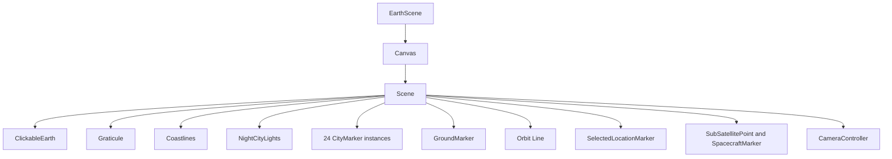

# 06 — 3D Earth Visualization

> **PRIVATE DEVELOPER REFERENCE — NOT PUBLIC-FACING**

## Plain-language picture

`EarthScene` draws an interactive Earth with coastlines, a grid, day/night lighting, city lights, observer and location markers, an orbit path, and a satellite marker. It does not fetch data. Its inputs arrive through `EarthSceneProps`.

That separation keeps the visual layer focused: dashboard code decides *what* state to show, and scene code decides *how* to draw it.

## Browser-only loading

`OrbitalDashboard` dynamically imports `EarthScene` with `ssr: false`. Three.js and React Three Fiber need browser rendering facilities, so the globe is not server-rendered.

`EarthScene` creates a React Three Fiber `Canvas` with camera position `[4.6, 2.7, 5.2]`, field of view `42`, and device-pixel ratio limited to `[1, 1.75]`. The pixel-ratio cap balances sharpness and GPU cost.

## Scene composition



The solid Earth is a sphere of radius `2`. Two larger transparent back-sided spheres create atmosphere-like shells. `Graticule` draws latitude and longitude lines every 15 degrees.

## Coastlines

`Coastlines` reads `data/land-110m.json`, converts its TopoJSON land object with `feature()`, and turns polygon rings into `Line` points.

`splitAtAntimeridian()` starts a new segment when adjacent longitudes differ by more than 180 degrees. Without that split, a coastline crossing the date line could draw a long false chord across the globe.

The source comment records that `world-atlas` `land-110m` is derived from public-domain Natural Earth data.

## Sun and city lights

`solarDirection(date)` estimates the Sun’s Earth-fixed direction from Julian date, mean longitude, mean anomaly, ecliptic longitude, obliquity, declination, right ascension, and sidereal rotation.

`Scene` derives the date from `state.timestamp`:

```ts
const sunDirection = useMemo(
  () => solarDirection(stateTimestamp ? new Date(stateTimestamp) : new Date()),
  [stateTimestamp],
);
```

This means moving simulation time also moves the light and night side. `NightCityLights` passes the Sun direction to a shader. Points fade in on the night side and use a small time-based glisten.

The city-light clusters are decorative approximations, not a population or live-light dataset.

## City pins

`MAJOR_CITIES` contains exactly 24 entries. `Scene` renders one `CityMarker` per entry. Some entries have `priority: true`; their labels can remain eligible at wider camera distances. Other labels appear when the camera gets closer.

Each marker converts its latitude and longitude through `latLonToScenePosition`. A quaternion aligns its circles to the local surface normal.

A click is ignored when `event.delta > 6`, helping distinguish a drag from a click. The city’s known coordinates are sent through `onLocationSelect`.

## Clicking anywhere on Earth

`ClickableEarth` attaches `onClick` directly to the Earth mesh. React Three Fiber supplies a `ThreeEvent<MouseEvent>` whose `event.point` is the 3D intersection point on that mesh.

```ts
const { latitude, longitude } = scenePositionToLatLon(event.point);
```

The implementation does **not** manually construct a Three.js `Raycaster`. React Three Fiber performs event intersection handling and provides the result.

## Markers and path

- `GroundMarker` shows the current observer.
- `SelectedLocationMarker` shows a stem, ring, and animated pulse.
- `SubSatellitePoint` connects the surface point below the satellite to its true display position.
- `SpacecraftMarker` shows a bright sphere, animated halo, and point light.
- The orbit path is a Drei `Line` when at least two points exist.

The spacecraft’s marker size is a visual symbol; unlike altitude distance, marker size is not physically to scale.

## Camera modes

`CameraController` supports the exact `EarthViewMode` values:

- `"earth"`: free globe exploration.
- `"location"`: transitions toward `selectedLocation` at distance `3.75`.
- `"satellite"`: follows the normalized `state.displayPosition` at distance `6.1`.

Rotation and zoom are disabled in satellite mode. In other modes, `OrbitControls` allows rotation and zoom but not panning.

Camera distance produces `CITY VIEW`, `LOCAL VIEW`, `REGIONAL VIEW`, or `GLOBAL VIEW`. `onScaleChange` sends a new label only when the category changes.

## Resource care

`NightCityLights` memoizes its `BufferGeometry` and disposes it in an effect cleanup. Refs let `useFrame` update shader uniforms and animation transforms without forcing a React render for every frame.
