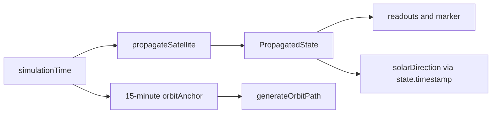

# 07 — Dashboard and Simulation Time

> **PRIVATE DEVELOPER REFERENCE — NOT PUBLIC-FACING**

## Plain-language picture

`OrbitalDashboard` is the application’s main coordinator. It loads the catalog, chooses a satellite, advances time, computes derived values, handles outages, owns the observer, and connects Earth Explorer to the globe.

It is a client component because it depends on React hooks, `localStorage`, browser events, and client-side fetches.

## Main state groups

The state can be understood in five groups:

| Group | Current state names |
|---|---|
| Satellite data | `catalogData`, `selectedId`, `selected`, `query` |
| Time | `simulationTime`, `playbackSpeed`, `isLive`, `clock` |
| Observer | `observer` |
| Feed health and UI | `error`, `outageAcknowledged`, `feedRestoredNotice`, `aboutOpen`, `requestKey` |
| Earth Explorer | `earthViewMode`, `selectedEarthLocation`, `returnViewMode`, `earthScale` |

Refs store mutable coordination values that should not cause rendering by themselves: `locationRequestId` and `feedWasUnavailable`.

The component currently uses local state and props. It does not use React Context, a global state store, or `useCallback`.

## Catalog and selection

One effect fetches `/api/catalog` whenever `requestKey` changes. It selects NORAD `25544` when that object is featured; otherwise it falls back to the first featured entry and then the first catalog entry.

Another effect fetches `/api/satellites/${selectedId}`. Both use `AbortController`, and their cleanup aborts an obsolete request.

`selectSatellite(entry)` clears `selected` before updating `selectedId`. That causes `LoadingScreen` to appear until the complete OMM record arrives, avoiding a temporary mismatch between the new ID and old orbital state.

## The two time values

`clock` follows wall-clock time. `simulationTime` is the time sent to `propagateSatellite`.

Every second, one interval does this conceptually:

```text
clock = now
if live: simulationTime = now
else if playbackSpeed > 0: simulationTime += playbackSpeed seconds
```

At `60x`, each real second advances simulation time by 60 seconds. At `300x`, it advances by five simulated minutes.

## Time controls

- `jump(-1)` and `jump(1)` move one hour, leave live mode, and pause playback.
- `returnLive()` resets `simulationTime` to the current time, enables live mode, and restores `1x`.
- Pause sets `playbackSpeed` to `0` and disables live mode.
- Playback buttons set `1`, `60`, or `300` and disable live mode.
- The range input sets an offset from `Date.now()` between `-6` and `+6` hours, then pauses.

`deltaMs` is `simulationTime - clock`. `formatSimulationDelta(deltaMs)` renders the signed `HH:MM:SS` offset.

## What recalculates when time changes



`state` updates with every simulation tick. The orbit line updates only when the rounded-down 15-minute anchor changes or when the satellite/characteristics change. This preserves smooth marker movement without sampling 181 path points each second.

`characteristics` uses real `clock` as its `at` value so element age reflects now, even during a future or past simulation.

`calculatePasses(satrec, observer)` currently uses its default `startTime = new Date()`. Pass predictions therefore begin at real current time, not `simulationTime`.

## Observer persistence

`DEFAULT_OBSERVER` is York, Pennsylvania at latitude `39.9626`, longitude `-76.7277`, and altitude `0.1 km`.

On mount, the dashboard reads `yts-orbital-observer` from `localStorage`. Parsing is scheduled with `requestAnimationFrame`; malformed JSON removes the stored value. `setObserver()` updates both React state and storage.

Earth Explorer’s “SET AS OBSERVER” action keeps the current observer altitude while replacing label, latitude, and longitude.

## Feed health

Healthy operation increments `requestKey` every five minutes. When `error` is set, retry frequency becomes one minute. The dashboard also retries on the browser `online` event and when the document becomes visible after an outage.

`feedWasUnavailable` helps distinguish first failure from restoration. A successful request after failure shows the feed-restored notice.

When satellite data fails, `EarthOnlyScreen` receives `state={null}` and `orbitPath={[]}` but keeps the interactive Earth and geocoding tools available.

## Why this design works for learning

The data transformations remain visible: fetched OMM, prepared `SatRec`, propagated `PropagatedState`, and rendered scene. The time machine changes one input, `simulationTime`, so a learner can follow cause and effect without a hidden backend animation stream.
