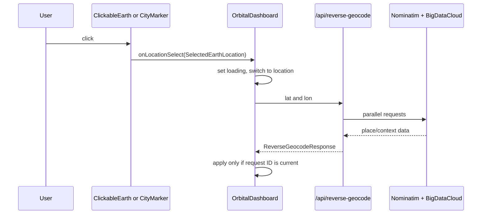

# 08 — Earth Explorer

> **PRIVATE DEVELOPER REFERENCE — NOT PUBLIC-FACING**

## Plain-language picture

Earth Explorer lets a learner choose a place in three ways: click the globe, click one of 24 city pins, or search by text. It then asks server routes for geographic names and context, focuses the camera, and can copy that location into the pass-prediction observer.

It works even when the CelesTrak feed is unavailable because its routes and state are independent of satellite data.

## View modes

`EarthViewMode` in `types/orbital.ts` is exactly:

```ts
type EarthViewMode = "earth" | "location" | "satellite";
```

- `"earth"` allows free globe rotation and zoom.
- `"location"` focuses the selected place.
- `"satellite"` follows the propagated spacecraft.

`EarthExplorerPanel` disables Location when there is no `selectedLocation`. It disables Satellite when `satelliteAvailable` is false. `EarthOnlyScreen` converts an incoming satellite mode to earth mode.

## Selection flow



A generic globe click uses React Three Fiber’s intersection `event.point`. `scenePositionToLatLon(event.point)` converts that point into geographic coordinates. No manual `Raycaster` is created.

A city-pin click already has known coordinates. `MAJOR_CITIES` in `components/globe/earth-scene.tsx` contains 24 city records.

Both paths create `SelectedEarthLocation` with `source: "globe"`. A text-search choice uses `source: "search"`.

## Forward geocoding

The `search` function in `EarthExplorerPanel` calls:

```text
GET /api/geocode?q=<encoded query>
```

`GET` in `app/api/geocode/route.ts` validates a non-empty query no longer than `120` characters. It calls the Nominatim search endpoint with:

- `format=jsonv2`
- `limit=5`
- `addressdetails=1`
- an identifying `User-Agent`
- `Accept-Language: en`
- an 8-second timeout

`normalizeResult()` rejects invalid coordinates or missing display names and returns `GeocodeResult`. The route returns no more than five results.

The server fetch revalidates after one day. Its response cache allows one day fresh and seven days stale while revalidating.

## Reverse geocoding and context

`selectEarthLocation()` in `OrbitalDashboard` calls:

```text
GET /api/reverse-geocode?lat=<latitude>&lon=<longitude>
```

The route validates latitude from `-90` to `90` and longitude from `-180` to `180`. It sends parallel requests using `Promise.allSettled`:

- Nominatim reverse geocoding supplies names, address parts, and optional population tags.
- BigDataCloud supplies additional locality and informative geographic context.

The route succeeds if either provider supplies usable data. `normalizeLocation()` combines them into `ReverseGeocodeResponse` and `LocationDetails`.

It can identify locality, region, country, nearest city, body of water, geographic feature, population, and whether an area appears remote. These values are provider-derived context, not measurements made by YTS Orbital.

## Stale-request protection

A user can click several places before earlier network requests finish. Without protection, an old response could overwrite the newest selection.

`locationRequestId` is a ref in `OrbitalDashboard`. Every selection increments it and captures the new value:

```ts
const requestId = ++locationRequestId.current;
```

Before applying success or failure state, `selectEarthLocation()` checks that the captured ID still matches `locationRequestId.current`. `clearEarthLocation()` also increments the ref, invalidating an in-flight lookup.

This is a request-order guard. The fetch itself is not aborted, but stale results cannot update the selected location.

## Search-result behavior

`chooseResult(result)` sends the chosen coordinates and display name to `onLocationSelect`, then clears the visible result list. The dashboard still performs reverse geocoding so a search selection receives the same normalized `LocationDetails` as a globe click.

The panel uses these lookup states:

- `"loading"`: geographic context is being resolved.
- `"resolved"`: `details` and normalized `displayName` are available.
- `"unavailable"`: coordinates remain selected but context lookup failed.

This preserves useful coordinates even when a provider is temporarily unavailable.

## Camera and return behavior

On the first location selection, `OrbitalDashboard` stores the previous non-location mode in `returnViewMode`. It then changes `earthViewMode` to `"location"`.

`clearEarthLocation()` removes the selection and returns to `returnViewMode`, except during a satellite-feed error, when it returns to `"earth"`.

`CameraController` detects mode or focus-coordinate changes and smoothly transitions toward the selected surface direction. Manual controls remain available outside satellite mode.

## Observer handoff

`setSelectedAsObserver()` copies the selected label and coordinates into `ObserverLocation` while preserving the existing `altitudeKm`. That location is stored through `setObserver()` and immediately becomes the ground marker and pass-prediction observer.

## Attribution and responsible use

The panel displays OpenStreetMap contributor attribution and BigDataCloud attribution. Provider results can be incomplete, approximate, delayed, or unavailable. “Remote” and population labels are normalized heuristics from returned fields; they should not be presented as authoritative demographic analysis.
